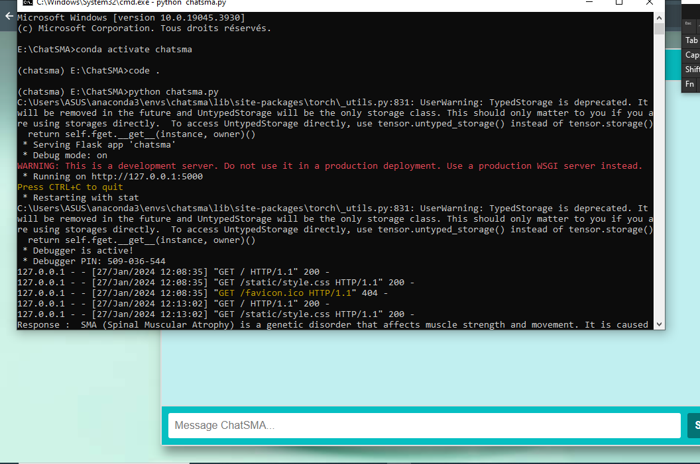

# ChatSMA: Medical Chatbot for Genetics and SMA Diseases
The Medical Chatbot for Genetics and SMA (Spinal Muscular Atrophy) Diseases is an intelligent conversational system designed to assist users in understanding and discussing topics related to genetics and SMA diseases. Built using Python, LangChain, Flask, Meta Llama2 model, and Pinecone, this chatbot provides a user-friendly interface for users to ask questions, seek information, and engage in meaningful conversations about genetics and SMA diseases.

## Description
This chatbot leverages cutting-edge technologies to deliver accurate and informative responses to user queries regarding genetics and SMA diseases. With its intuitive interface and robust backend infrastructure, users can interact with the chatbot seamlessly, gaining insights and guidance on various aspects of genetics and SMA diseases

The chatbot's core functionalities include:

- Providing information about genetics, inheritance patterns, and genetic disorders.
- Offering insights into SMA diseases, including causes, symptoms, and treatment options.
- Engaging users in interactive conversations to address specific queries and concerns.
- Utilizing advanced language models and AI algorithms to understand user intent and generate relevant responses.

## Technologies 

- Python
- LangChain
- Flask
- Meta Llama2 model
- Pinecone

## Execution Steps

1. create a `.env` file in the root directory and add your Pinecone credentials:
```ini
PINECONE_API_KEY = "xxxxxxxxxxxxxxxxxxxxxxxxxxxxx"
PINECONE_API_ENV = "xxxxxxxxxxxxxxxxxxxxxxxxxxxxx"
```


2. Download the quantized model from the provided link and store it in the `model` directory:

### Llama 2 Model Used for This Project:

- `llama-2-7b-chat.ggmlv3.q8_0.bin`

### Access the following link to download the quantized model:
[Download Llama 2 Model](https://huggingface.co/TheBloke/Llama-2-7B-Chat-GGML/tree/main)

## Project Requirements

- Python 3.8
- LangChain library
- Flask library
- Meta Llama2 model
- Pinecone library

## Installation

1. Clone the repository:
```bash
git clone https://github.com/sami-rajichi/ChatSMA.git
```

2. Install the required Python packages:
```bash
pip install -r requirements.txt
```

## Usage

1. Run the Pinecone index store script to set up the database:
```bash
python pinecone_index_store.py
```

2. Run the Flask application to start the chatbot:
```bash
python chatsma.py
```

3. Access the chatbot interface via your browser.

## Project Screenshots

Here are some screenshots of the Medical Chatbot for Genetics and SMA Diseases:

1. 

2. 

3. 

## License

This project is licensed under the MIT License - see the [LICENSE](LICENSE) file for details.


